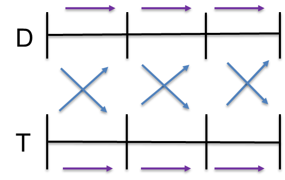

# What is co-simulation?
Describe co-simulation and mention references here.

## Assumptions

1. Under the current configuration, each OpenDSS instance can simulate one distribution feeder. This is based on the assumption that all the distribution feeders connected to the transmission system load bus have the same characteristics. A scaling factor K is calculated as the division of the total load at a transmission system load bus and the load of one distribution feeder. By multiplying the resulting power requirements of one feeder by the scaling factor K, one can emulate the effect that K feeders are connected to the same transmission load bus and each feeder has the same characteristics. 
2. 

## T&D interface

### Data exchange

After the transmission system simulator (TSS) completes a solution, it outputs the sequence voltages at the T&D interface. Then (1) is applied to convert the sequence voltages at the boundary bus to phase voltages. Using the phase voltages at the boundary bus, the DSS completes a solution and outputs the phase current injection at the boundary bus, which are expressed in (2).

$$
\begin{equation}
\left[\begin{array} {r} V_{DS,a}\\V_{DS,b}\\V_{DS,c} \end{array}\right]=
\left[\begin{array} {r} 1\\1\angle-120\\1\angle120 \end{array}\right]V_{TS,+}\tag{1}
\end{equation}
$$

$$
\begin{equation}
I_{DS}=
\left[\begin{array} {r} I_{DS,a}\\I_{DS,b}\\I_{DS,c} \end{array}\right]\tag{2}
\end{equation}
$$

The phase current injection at the boundary bus is converted to sequence quantities using (3). The current injection at the boundary bus is then used to obtain complex power injection at the boundary bus using (4).
$$
\begin{equation}
\left[\begin{array} {r} I_{DS,0}\\I_{DS,+}\\I_{DS,-} \end{array}\right]=
\frac{1}{3}\left[\begin{array} {rrr} 1&&1&&1\\1&&a&&a^2\\1&&a^2&&a \end{array}\right]\left[\begin{array} {r} I_{DS,a}\\I_{DS,b}\\I_{DS,c} \end{array}\right]\tag{3}
\end{equation}
$$

$$
\begin{equation}
S_{TS,+}=V_{TS,+}.I^*_{TS,+}\tag{4}
\end{equation}
$$

The obtained value of S_(TS,+) is used as the total power requirement for the said load bus at the transmission system. It is worth mentioning that the equivalence load that is replaced with the distribution system simulator is modeled as a constant power load with respect to the transmission system simulator . The data exchange across the T&D interface is illustrated in Fig. 1.

### Synchronization

Boty static and dynamic co-simulation starts with an initialization for both PSSE and OpenDSS software. The T&D interface contains sockets that enable simulators to communicate and exchange data. Specifically, the TSS and the DSS are synchronized through two protocols, namely, loosely coupled and tightly coupled protocols. The loosely coupled protocol is illustrated in Fig. 2.

***Fig.1.*** Loosely couple protocol

### Steady-state T&D Co-simulation Process
In this section, the steady-state simulation processes using PSSE and OpenDSS are explained in detail. The data exchange protocol employed is loosely coupled. 

### Dynamic T&D Co-simulation Process
In this section, the dynamic simulation process using PSSE and OpenDSS is explained in detail. 
