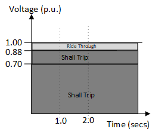
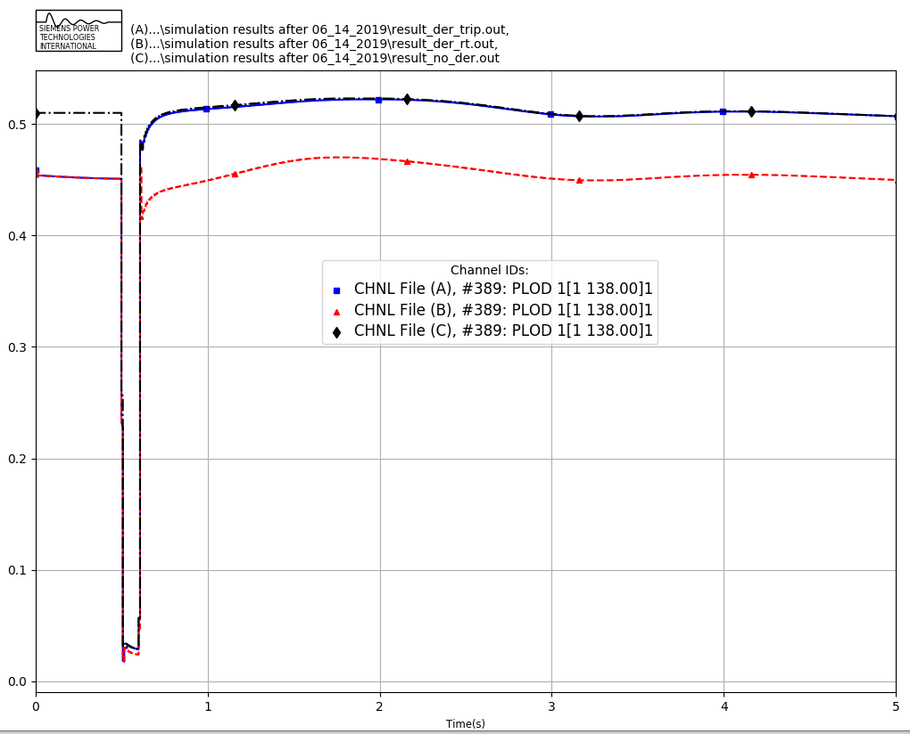
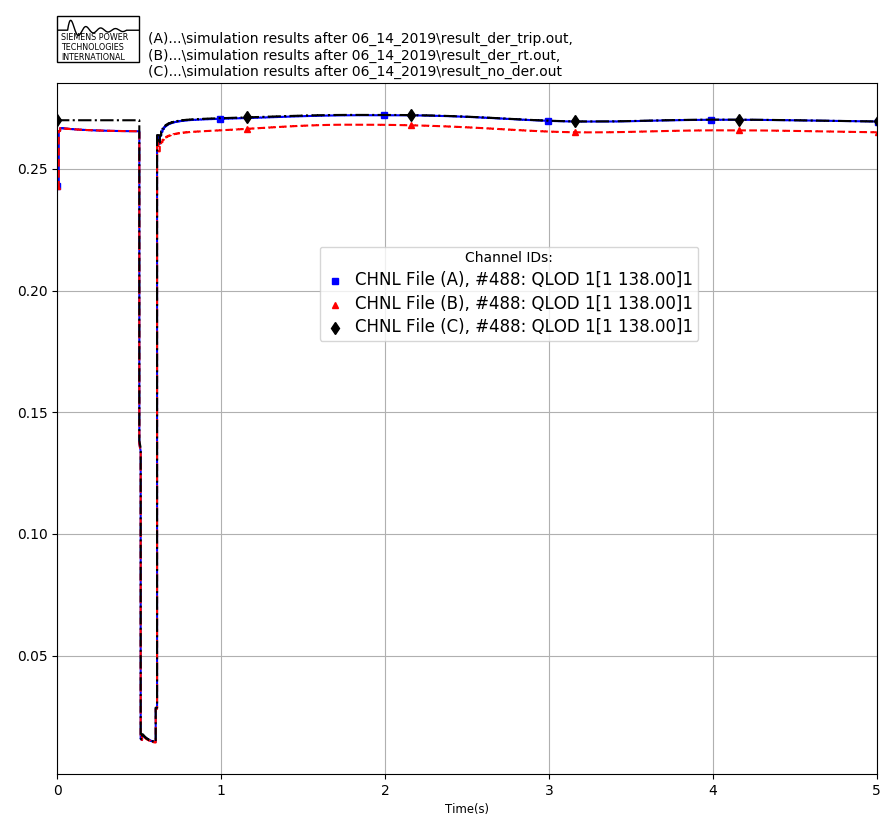
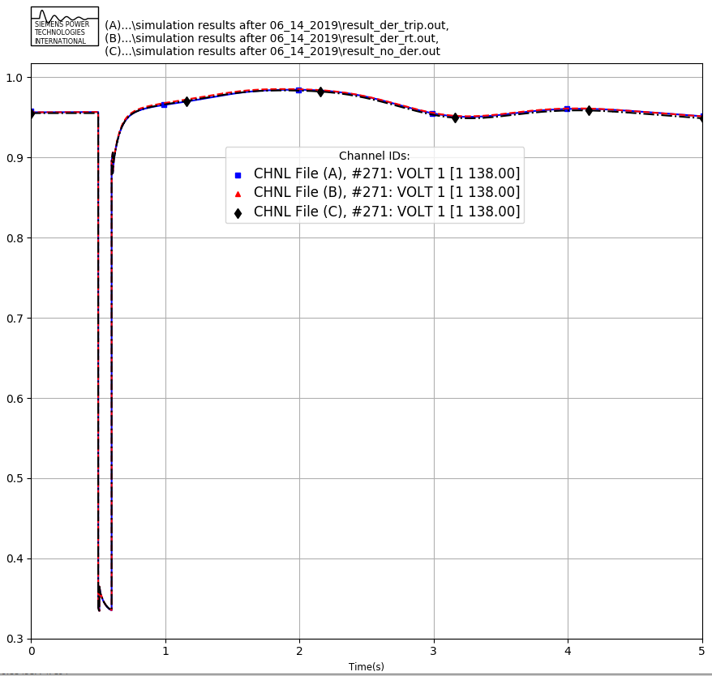
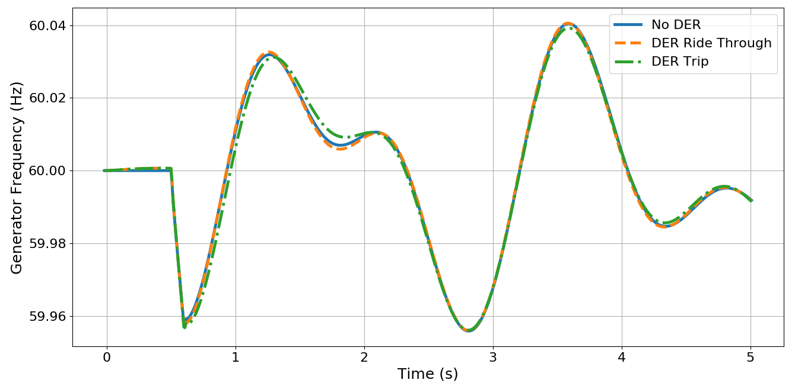

# Example 1: Test Example with Single Distribution System comparing the impact of DER Tripping with DER riding through fault.

In this test, the TDcosim tool is tested for three different scenarios:
1. With distribution system connected to Bus 59 of 68 bus system where the DER penetration level is 2% of distribution system load (PV placed at bus 50, 51 and 25 in IEEE-123 bus distribution system) 

```json
{
    "cosimHome": "..\\tdcosim",
    "psseConfig":{
        "installLocation": "C:\\Program Files\\PTI\\PSSE35\\35.0\\PSSPY27",
        "rawFilePath":"..\\SampleData\\TNetworks\\68bus\\68_bus.raw",
        "dyrFilePath":"..\\SampleData\\TNetworks\\68bus\\68_bus.dyr"        
    },
    "openDSSConfig":{        
        "defaultFeederConfig":{
            "filePath":["..\\SampleData\\DNetworks\\123Bus\\case123ZIP.dss"],
            "solarFlag":0,
            "solarPenetration":0.0
           
        },
        "manualFeederConfig":{
            "nodes": [
                {
                    "nodenumber": 59,
                    "filePath": ["..\\SampleData\\DNetworks\\123Bus\\case123ZIP.dss"],
                    "solarFlag":1,
                    "DERFilePath": "..\\examples\\config_der.json",
                    "initializeWithActual":true,
                    "DERSetting":"PVPlacement",
                    "DERModelType":"ThreePhaseUnbalanced",
                    "DERParameters":{
                        "default":{
                        "solarPenetration":0.02,
                        "derId":"50",
                        "powerRating":50,
                        "VrmsRating":177.0,
                        "steadyStateInitialization":true,
                        "pvderScale": 1
                                              
                         },
                        "PVPlacement":{"50":{"derId":"50","powerRating":50,"pvderScale":1},
                                       "51":{"derId":"50","powerRating":50,"pvderScale":1},
                                       "25":{"derId":"50","powerRating":50,"pvderScale":1}
                                      }                            
                    }
                }
            ]
        }
    },
```
The DERs connected in the distribution system follow "LVRT_1547cat3" config
The ER TRIP instantaneously below level "0" voltage threshold. 
The DER Ride Through the fault above level "1" and level "2" voltage threshold. 
The DER configuration used for this case is shown below:
```json
	  "LVRT":{"config_id":"LVRT_1547cat3"},
	  "VRT_delays":{"config_id":"VRT_delay_cat3"}
	 },
"50_type1":{"parent_config":"50",						  
			"inverter_ratings":{"Ioverload":1.0}
	 },
"50_type2":{"parent_config":"50",
			"LVRT":{"config_id":"LVRT_1547cat3_rev1"}
	 },
"VRT_delay_cat3":{"config":{"output_cessation_delay":0.01,
							"output_restore_delay":0.1,
							"restore_Vdc":false}
				},
"LVRT_1547cat3":{"config":{"0":{"V_threshold":0.5,
								"t_threshold":0.25,
								"mode":"momentary_cessation",
								"t_start":0.0,
								"threshold_breach":false},
							"1":{"V_threshold":0.7,
								 "t_threshold":3.5,
								 "mode":"mandatory_operation", 
								 "t_start":0.0,
								 "threshold_breach":false},
							"2":{"V_threshold":0.88,
								 "t_threshold":5.0,
								 "mode":"mandatory_operation",
								 "t_start":0.0,
								 "threshold_breach":false}
								  }
						},
```

The DER trip settimg used for this case is shown in Figure A below.



Figure A: DER operational settings curve for the instantaneous trip settings.


2. With distribution system connected to Bus 1 of 118 bus system where the DER penetration level is 10% of distribution system load 
and the DERs connected in the distribution system Ride Through the fault causing voltage sag below level "0" voltage threshold. The DER configuration used for this case is shown below:


```json
"manualFeederConfig":{
        "nodes": [
            {
                "nodenumber": 1,
                "filePath": ["\\SampleData\\DNetworks\\123Bus\\case123ZIP.dss"],
                "solarFlag":1,                
                "DERParameters":{
                "default":{
                    "solarPenetration":0.1, 
                    "powerRating": 50,
                    "VrmsRating":174,
                 "LVRT":"1":{"V_threshold":0.88,
                             "t_threshold":2.0,
                             "mode":"mandatory_operation"
                             }
                            }
                }}
            }
        ]
    }
```

 The DER trip settimg used for this case is shown in Figure B below.

 
 
 Figure B: DER operational settings curve for the DER ride through settings.
                        
3. With distribution system connected to Bus 1 of 118 bus system without any DERs on the distribution system. The DER configuration used for this case is shown below:


    "manualFeederConfig":{
            "nodes": [
                {
                    "nodenumber": 1,
                    "filePath": ["\\SampleData\\DNetworks\\123Bus\\case123ZIP.dss"],
                    "solarFlag":1,                
                    "DERParameters":{
                    "default":{
                        "solarPenetration":0.0
                              }
                    }}
                }
            ]
        }


A fault is applied in bus 10 of the T-system which causes a lower voltage sag in the D-system connected in bus XX. The simulation configuration to apply fault on bus 10 is shown below.


```json
	"simulationConfig":{
		"defaultLoadType":"complex_load",
		"dera":{"1547_2003":[60]},
		"simType":"dynamic",
		"memoryThreshold": 1024.0,
		"dynamicConfig":{
			"events":{
				"1":{
					 "time":0.1,
					"type":"faultOn",
					"faultBus":10,
					"faultImpedance":[0.0,-10000]
				},
				"2":{
					"type":"faultOff",
					"time":0.267,
					"faultBus":10
				},
				"3":{
					"type":"simEnd",
					"time":0.3
				}
			}
		},
		"protocol":"loose_coupling"
	},
   "outputConfig": {
      "simID": "LVRT_1547cat3", 
      "type": "xlsx", 
      "outputDir": "..\\output", 
	  "outputfilename": "test",
	  "scenarioID":"1"
	},
```



Figure 1: Active component of load as observed at the T-bus for the cases considered. (A): 10% DER penetration with DER TRIP Settings, (B): 10% DER penetration with DER RT Settings and (C) 0% DER penetration.

Figure 1 above compares the active power component of the load observed in the T-bus for the three cases considered. It can be observed that case C, without DER on the distribution starts off with higher initial net load. Case A and Case B has a lower initial net load due to the DER connected in the distribution system masking the portion of total load in the system. Here net load is defined as the difference of the total load in the distribution system and the DER connected in the distribution system. 

For the DER trip case, Case A, it can be observed that the net load observed in the bus increases to a value equal to the case without any DERs in the system, case C, which is an expected response of the system as net load in the T-bus reverts back to the total load as DER in the distribution system trips. A similar response can be observed for the reactive power component of the net load in the system as shown in Figure 2, which shows that the net reactive power equals the total reactive power as when DER trips, the system reverts back to the operational condition before DER connection in the system.



Figure 2: Reactive component of load as observed at the T-bus for the cases considered. (A): 10% DER penetration with DER TRIP Settings, (B): 10% DER penetration with DER RT Settings and (C) 0% DER penetration.



Figure 3:  T-bus 1 voltage comparison for the cases considered. (A): 10% DER penetration with DER TRIP Settings, (B): 10% DER penetration with DER RT Settings and (C) 0% DER penetration.



Figure 4:  Generator 1 Speed Comparison for the different cases considered.

Figure 3 shows the transmission bus voltage for bus 1 for the three cases considered. It can be observed that the voltage at bus 1 is same for all the cases considered. This is because for this case bus 1, where distribution system is connected, also had a synchronous generator connected to it which was regulating the bus voltage. Figure 4 shows the generator rotor frequency for the cases considered. It can be observed that the frequency nadir following system fault close to the fault location is lower for the case with DER trip. More tests with more distribution system and DERs should be performed to properly study the impact of DERs on system frequency response.
