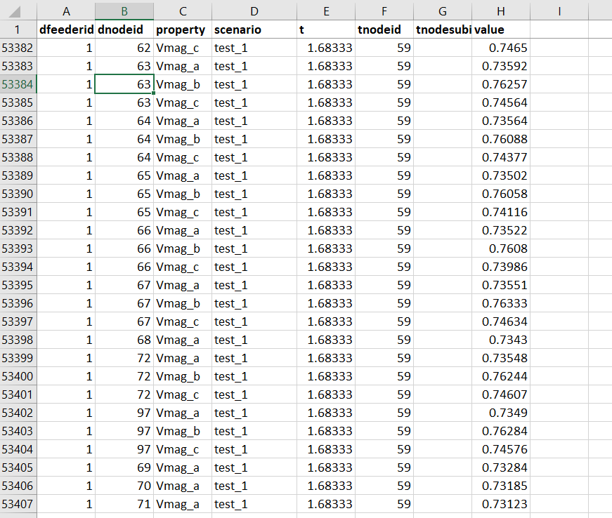

# Getting started with TDcoSim

In this section, we describe how you can get started with using **TDcoSim** to conduct static or dynamic co-simulation studies for T & D systems with different DER penetration levels and various events.

## 1. Setup TDcoSim

Please install the software per installation instructions as the first step (Installation instructions for can be found [here](user_guide_installation.md#installation)). Make sure the system requirements are satisfied (System requirements can be found [here](user_guide_sys_requirements.md)). 

## 2. Information required by TDcoSim
1. Specify version of PSS/E (either PSS/E 33 or PSS/E 35)
1. Specify parameters for the power system to be analyzed:
   
   * Transmission system
        * Transmission system model (e.g. IEEE 118 bus system)
        * Buses where distribution system models are attached
        * Type of load model (static,ZIP,CLOD,CMLD).
        * Presence of DER_A model
   * Distribution system
        * Distribution system model (e.g. IEEE 123 node feeder)
        * Solar PV penetration level (fraction of the distribution system load)
        * Scaling factor for power output from single DER model instance 
   * DER parameters  (optional)
        * Type of DER model (fast DER or detailed DER)
        * DER voltage and power ratings (e.g. 50 kW, 175 V)
        * DER interconnection standard during voltage anomaly (eg. IEEE 1547 Category II)
        * Settings specific to detailed DER:
          * DER configuration file path
          * DER configuration ID (e.g. '50') -> only for detailed
          * Type of ODE solver
   
2. Specify whether simulation is static or dynamic.

3. Specify length of simulation (e.g. 5 s).

4. Specify transmission bus fault events (optional).

   * Start and end time of fault (for e.g. 0.5 s, 0.667 s)
   * Bus at which fault occurs and fault impedance value.

6. Specify directory for logging, and results.

***
***Note:*** Frequency ride through will be included in future version.

***
***
***Note:*** Other disturbance events like loss of generator, line trip etc. will be included in future version.

***

## 2. Configure T & D & DER models and simulation scenarios

There are two options to configure and start the T&D co-simulation. The first is to manually populate the configuration file and the second option is to use the configuration template functionality.

### Option 1
#### Manually populating the configuration file

The power system models and simulation scenarios defined in the previous section can be transferred to TDcoSim using the **config** file (detailed explanations for every entry in the **config** file is provided [here](user_guide_understanding_config.md#understanding-the-config-file)). The file formats currently supported are:

* Transmission system model: *.raw, *.dyr
* Distribution system model: *.dss

***
***Note:*** The **config** file can be edited with Notepad++.

***
***
***Note:*** The **config** file should be in the same folder as **tdcosimapp.py**.

***

#### Start a co-simulation using run_*.py

Once the **config** file has been populated with the required entries, the user can start the co-simulation through either **run_qsts.py**, **run_time_domain.py**, or **run_aggregatedDERApp.py** depending on the type of co-simulation. To do this open the command line prompt within the folder containing the the **run_.py** files and run the following script.

```
python run_time_domain.py > log_file.txt
```


***
***Note:*** tdcosimapp.py is the default name of script that starts the co-simulation. If desired the user can write his/her own script by following the instructions given [here](user_guide_using_tdcosim.md#tdcosim-advanced-usage).

***


***
***Note:*** Logs generated during co-simulation are written to log_file.txt (or any other user specified **.txt file**).

***
### Option 2
This option avoids the need to manually populate the configuration file and instead uses templates  that are tailor made for a specific type of study or scenario. A detailed description of this provided in the [Using the configuration template](user_guide_user_interaction.md) chapter.

## 3.  Accessing the results

Outputs (from both transmission and distribution systems) are saved in the following formats within the user specified output folder at the end of the co-simulation:
1. PSS/E channel output file (**.out**) for containing all the simulated quantities from PSS/E.
2. A pickle (**df_pickle.pkl**) file containing a data frame (as shown in Fig. 1) with simulated quantities from both PSS/E and OpenDSS.
3. An **options.jSON** file containing the configuration parameters for the co-simulation. 
4. A CSV or an MS Excel file (**.xlsx**) with the same information as the df_pickle.pkl file (as shown in Fig. 1).


<p align="center">
  <strong>Fig. 1. </strong>Dynamic T&D co-simuation report in MS Excel format.
</p>
***
***Note:*** Both the **.xlsx** file and the **.out** file will be found in the folder specified by the user through the config file

***

## Examples

**config** files for static and dynamic co-simulation scenarios as well as **run_qsts.py** and **run_time_domain.py** are provided in the '**examples**' folder within the TDcoSim repository.

\pagebreak