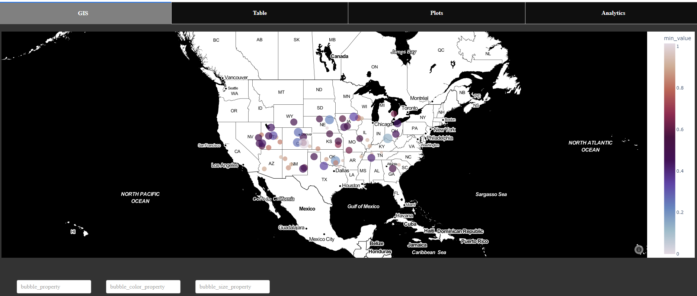
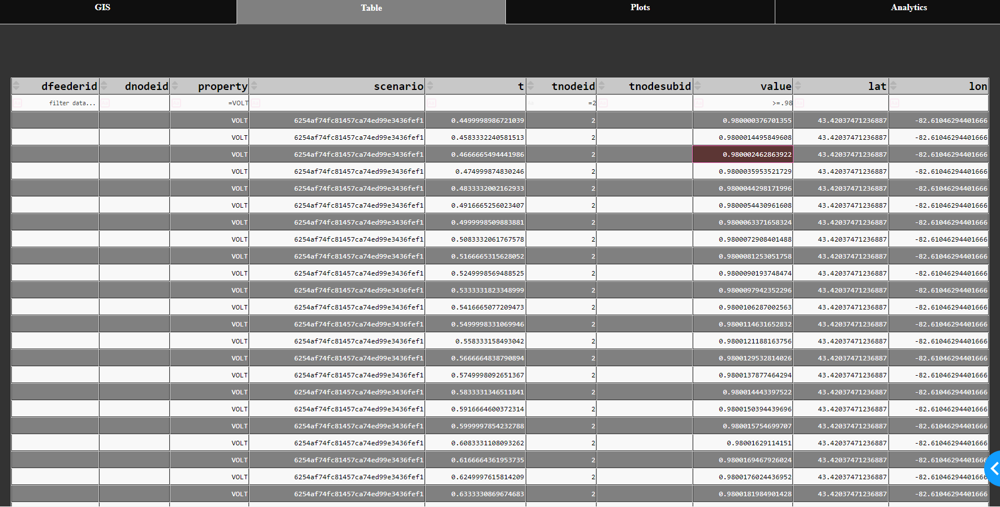
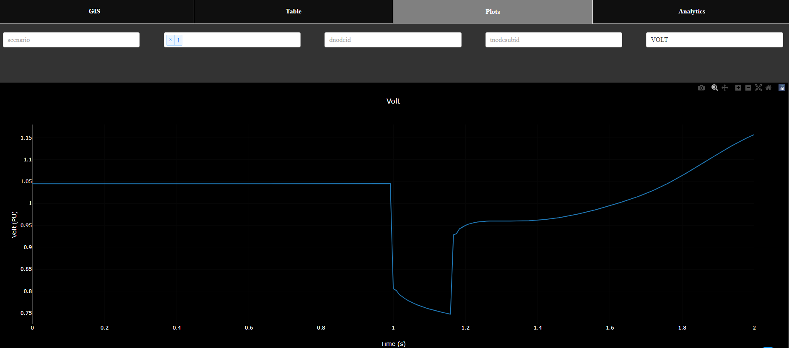

# Using Data Visualization and Analytics


During the co-simulation, TDcoSim collects and stores a large amount of data from the transmission system, distribution system, and DER models. The amount of data may make it challenging for the user to make effective use of it. We have implemented the following three features to  improve the user experience with using the co-simulation data:
1. Store data using a TDcoSim DataFrame.
2. Provide a visualization dashboard
3. Provide data analytics module.

## TDcoSim DataFrame
TDcoSim uses a custom data frame known as TDcoSim DataFrame to store and manage the data from the transmission, distribution, and DER simulations. Note that this data frame is not in a time-series format. Each entry in the data frame describes the attributes of a co-simulation quantity. Each entry is represented by a row, and each attribute is represented by a column. The attributes are as follows:


1. *scenario*: It specifies the co-simulation scenario from which the value was generated. Note that this can be specified through the **scenarioID** in the config file.
2. *tnodeid*: It specifies the transmission system bus which was the source of the value.
3. *dnodeid*: It specifies the distribution system node which was the source of the value. Note that this will only have a value if the entry is a distribution system quantity.
4. *t*: It specifies the time stamp of the co-simulation quantity.
5. *property*: It specifies the type of co-simulation quantity. Some of the valid values are: VOLT, ANGL, POWR, VARS 
6. *value*: It specifies the numerical value of the co-simulation quantity.

Both the visualization and data analytics features available in TDcoSim uses the TDcoSim DataFrame as the underlying data structure.

## Visualization
The visualization module provides a simple way to quickly visualize the co-simulation data without having to write code. Visualization is done through a browser-based dashboard built using the [Dash](https://github.com/plotly/dash) framework. The plots within the visualization were created using [Plotly](https://github.com/plotly/plotly.py).

### Launching the TDcoSim dashboard
Before the TDcosim dashboard (hereafter referred to as 'dashboard') can be launched, the location of the co-simulation results (in the TDcoSim DataFrame format) should be known.  If we want to visualize the results from a single file,  we can specify the file name through the **-o** argument. The following command may be used on the command-line interface. Note that **path/to/results.pkl**  should be replaced with the path to Pickle file or CSV file containing the TDcoSim DataFrame.


```
   tdcosim dashboard -o "path/to/results.pkl"
```
If we want to visualize the results from multiple files within a folder,  we can again specify the folder path through the **-o** argument. Note that **path/to/results/folder**  should be replaced by the folder containing the individual simulation folders containing the TDcoSim DataFrame.

```
   tdcosim dashboard -o "path/to/results/folder"
```
By default, dashboard will read 2 files (CSV followed by Pickle). However, we can specify the number of files that dashboard reads using the **-n** argument. The command shown below will read a maximum of 10 files from the simulation folders.
```
   tdcosim dashboard -n 10 -o "path/to/results/folder"
```
By default, the dataframes are loaded onto the system memory using **Pandas**. Sometimes reading a large number of files will result in an out-of-memory error. In such circumstances, the user makes use of the Dask by setting the **-d** flag to true.
```
   tdcosim dashboard -n 10 -d True -o "path/to/results/folder"
```

All the above commands will result in the following output:


<p align="center">
  <strong>Fig. 1. </strong>Starting TDcoSim dashboard.
</p>
Copy and paste the web address (**http:/127.0.0.1:8050** in Fig. 1) into your browser. The dashboard will load after a few seconds. There are four tabs on the dashboard corresponding to four visualization capabilities, each of which are explained below.

***
***Note:*** Using the dashboard only requires TDcoSim to be installed. It does not require PSS/E or OpenDSS to be installed. Therefore, co-simulation results that were generated in another machine can be copied to a machine without PSS/E or OpenDSS and then visualized.

***
***
***Note:*** Using the Dask option can result in slower visualization times compared to using Pandas. Hence it should only be used when a large number of files need to be loaded onto the dashboard.

***

#### GIS
This visualization overlays all the nodes contained in the T system on a geographical map as bubble plots as shown in Fig. 2. The position of the bubbles is determined by latitude and longitude coordinates corresponding to each node in the T system.


<p align="center">
  <strong>Fig. 2. </strong>GIS visualization on TDcoSim dashboard.
</p>

The information on the GIS can be further customized using the following fields:

1. *bubble_property:* This selects the type of co-simulation variable that is being visualized by the bubbles. E.g. voltage, angle, speed.
2. *bubble_color_property:* This specifies the statistical property of the selected co-simulation variable that determines the color of the bubble. Note that the color map is included on the right. E.g. min, max, standard deviation.
3. *bubble_size_property:* This specifies the statistical property of the selected co-simulation variable that determines the size of the bubble. E.g. min, max, standard deviation.

***
***Note:*** It is the responsibility of the user to supply the correct latitude and longitude coordinates corresponding to each T node. If no coordinates are supplied TDcoSim dashboard will assign random coordinates automatically.

***

#### Table
The Table visualization tab displays the entire data frame as an interactive Table as shown in Fig. 3. The table has column-wise filtering capability using logical operators. E.g. in Fig. 3. **property** column was used to filter out all the voltage values, the **tnodeid** column was used to filter out the values belonging to T node 2, and finally, the **value** column was used to filter out the voltage values greater than or equal to 0.98.


<p align="center">
  <strong>Fig. 3. </strong>Interactive table on TDcoSim dashboard.
</p>

#### Plots
The Plots visualization tab allows the user to visualize any co-simulation variable as interactive time-series plots as shown in Fig. 4. The fields provided correspond to the attributes of the [TDcoSim DataFrame](#TDcoSim-DataFrame) and desired quantities can be plotted by appropriately plotting the fields. The plots may also be downloaded as .PNG images. You can filter the plots based on **scenario** and **tnodeid** for T side variables.

***
***Note:*** All the quantities being plotted should have the same property. E.g. you can't have a plot with voltage and angle from one node.

***


<p align="center">
  <strong>Fig. 4. </strong>Time series plot on TDcoSim dashboard.
</p>


## Data Analytics
The data analytics module provides a set of useful methods for extracting useful information from the co-simulation data. This will enable the user to perform analytics without having to write code for it.
### Using the data analytics
The methods within the module are accessed using the Analytics tab on the TDcoSim dashboard. For users who want to use the module within their Python scripts, it can be imported using:
```python
      from tdcosim.data_analytics import DataAnalytics  
      da=DataAnalytics()
```
All the methods take the TDcoSim DataFrame as input. 
The most useful methods available within the module are described below:


#### *compute_stability_time:*   Determines whether the co-simulation variables within the data frame reach steady state, and the time taken to reach steady state after a disturbance event has occurred. The DataFrame has at least two columns: 1) value and 2) t.
* *Syntex:* stability_time, comment= compute_stability_time(df, error_threshold)
* *Inputs:*
     - *df:* 			DataFrame with at least two columns: 1) value, and 2) t.
     - *error_threshold:* 	Error threshold for stability time calculations. Maximum allowed signal deviation after stability time
* *Outputs:*
     - *stability_time:*		Time it takes for the signal to stabilize after disturbance 
     - *comment:*		Message if the system is stable or not
     - *max_deviation:*		Max signal amplitude deviation after stability 


####	*lag_finder:*        Calculate lag/delay between DataFrames df1 and df2 of the same length. Negative outputs show that signal df2.value lags behind df1.value and the positive output shows that df1.value lags behind df2.value. 
* *Syntex:* delay = lag_finder(df1, df2)
* *Inputs:*
     - *df1:* 			DataFrame 1 with at least one column: value
     - *df2:* 			DataFrame 2 with at least one column: value
* *Outputs:*
     - *delay:* 		Delay between signals df1.value and df2.value

####	*compute_mean_square_error:*       Calculate the mean square error between DataFrames df1 and df2 of the same length. 
* *Syntex:* MSE = compute_mean_square_error (df1, df2)
* *Inputs:*
     - *df1:* 			DataFrame 1 with at least one column: value
     - *df2:* 			DataFrame 2 with at least one column: value
* *Outputs:*
     - *MSE:* 		Mean square error between signal df1.value and df2.value

####	*shift_array:*       Shifts array by n bit. Fills extra bits at the end of the vector by a copy of the last bit of the array. 
* *Syntex:* x = shift_array(y, n)
* *Inputs:*
     - *y:* 			Signal (type: np.array)
     - *n:* 			Number of bits to shift the signal. Positive values of n shifts signal y to the right and negative values shift signals to the left.
* *Outputs:*
     - *x:* 		   Shifted signal

####	*instances_of_violation:*       Calculates the number of instances where the value of data frame violates upper and lower bounds set by minValue and maxValue.
* *Syntex:* n = instances_of_violation(df,maxValue,minValue)
* *Inputs:*
     - *df:* 			      DataFrame with at least one property: df.value
     - *maxValue:* 			Upper threshold 
     - *minValue:* 			Lower threshold
* *Outputs:*
     - *n:* 		         Number of instances when 'df.value' is outside the bounds of [minValue, maxValue]


####	*exculde_value:*       Filter the given data frame based on >=toValue and <=fromValue conditions. For == condition use the same value for fromValue and toValue.
* *Syntex:* excludedDF = exculde_value(df,fromValue,toValue)
* *Inputs:*
     - *df:* 			      DataFrame with at least one property: df.value
     - *fromValue:* 			Upper threshold 
     - *toValue:* 			Lower threshold
* *Outputs:*
     - *excludedDF:* 		Filtered data frame


####	*compare_signals:*       Compare and plot two signals in data frame df1 and df2 of the same length. Returns result in terms of stability time of both signals as well as lag and mean square error between them.

* *Syntex:* lag,MSE,Stability_time_1,Stability_time_2 = compare_signals(thisBusId1,thisBusId2,df1,df2,error_threshold,show_results)
* *Inputs:*
     - *thisBusId1:* 			      Bus ID of data frame 1
     - *thisBusId2:* 			      Bus ID of data frame 2
     - *df1:* 			               DataFrame 1 with at least one property: df1.value
     - *df2:* 			               DataFrame 2 with at least one property: df2.value
     - *error_threshold:* 			   Error threshold for mean square error and stability time calculations.
     - *show_results:* 			      Set to 1 to show the plot. 
* *Outputs:*
     - *lag:* 		                  Delay between signals 1 and 2
     - *MSE:* 		                  Mean square error between signals 1 and 2
     - *Stability_time_1:* 		   Time it takes for the signal 2 to stabilize after disturbance 
     - *Stability_time_2:* 		   Time it takes for the signal 1 to stabilize after disturbance

####	*plot_vt_filt_fast_der:*  Plot the voltage signal at given transmission node and DERs in the connected distribution system.       

* *Syntex:* plot_vt_filt_fast_der(df,tnodeid,legendDistNode,showPlot)
* *Inputs:*
     - *df:* 			               Data Frame 
     - *tnodeid:* 			         Transmission node ID
     - *legendDistNode:* 			   Set equal to True to show legend for distribution node id (Optional: if not specified set to False)
     - *showPlot:* 			         Set equal to True to show the plot (Optional: if not specified set to False)


####	*plot_t_vmag:*  Plot the voltage signal at given transmission node. If no transmission node id is given, it will plot voltage at all transmission nodes. 

* *Syntex:* plot_t_vmag(df,tnodeid,excludeNodes)
* *Inputs:*
     - *df:* 			               Data Frame 
     - *tnodeid:* 			         Transmission node ID (Optional: if not specified set to none)
     - *excludeNodes:* 			   Nodes to be excluded from the plot (Optional: if not specified set to none)
     


####	*plot_omega:*  Plot time vs rotor speed at all transmission nodes except specified. 
* *Syntex:* plot_omega(df,excludeNodes=None)
* *Inputs:*
     - *df:* 		Data Frame 	               
     - *excludeNodes:* 	Nodes to be excluded from the plot (Optional: if not specified set to none)		   


####	*plot_distribution_der_data:*  Plots the time series plots for active and reactive power output from each DER.
* *Syntex:* plot_distribution_der_data(df,tnodeid=None,plotDerTotal=True)
* *Inputs:*
     - *df:* 		                  Data Frame 	               
     - *tnodeid:* 			         Transmission node ID
     - *plotDerTotal:* 	Set true to plot total P and Q of distribution DERs  		   

####	*show_plot:*  Generate plot with time as x-axis and ylable as y-axis
* *Syntex:* show_plot(ylabel,title)
* *Inputs:*
     - *ylabel:* 			         Y-axis label 
     - *title:* 			         Plot title
     

####	*clear_plot:*  Clear the plot
* *Syntex:* clear_plot()

[Continue to Understanding the config file](user_guide_understanding_config.md)

\pagebreak
