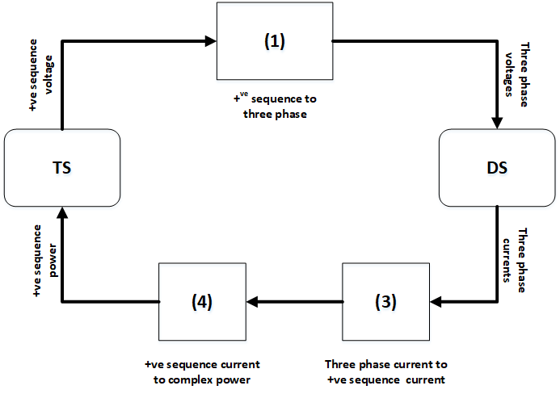

# T & D co-simulation with PSS/E and OpenDSS

This section provides a brief overview of T & D co-simulation with PSSE and OpenDSS as implemented in TDcoSim.

## Advantages

The state-of-the-art approach of studying DER impact on the bulk power system entails developing aggregate positive-sequence load and DER model for distribution systems and then applying these models in conventional positive-sequence transmission system simulation software such as PSSE, PSLF, etc. **TDcoSim** offers higher degree of fidelity since there is no need to parameterize the aggregate load and DER models for distribution system, which are only approximate representation of actual distribution system behaviors, 

**TDcoSim** also offers time savings by running an integrated T&D co-simulation compared to the approaches of running separate simulations for T&D systems and manually combining the results.

## Assumptions in current software version

1. It is assumed that all the distribution feeders connected to the transmission system load bus have the same characteristics. Hence only one distribution feeder is simulated in an OpenDSS instance. The power output from the single feeder is then multiplied with a scaling factor (calculated automatically by TDcoSim) so that we can match the rated load at the transmission bus with the total load from all the feeders connected to the bus.
2. No Sub-station is explicity added to the distribution network model by TDcoSim to interface the T bus with the distribution feeder. However if the user provided distribution network model comes with a sub-station, then it is used.

## T&D interface
The transmission system simulator (TSS) and distribution system simulator (DSS) are separate programs with their own solution methods. **TDcoSim** is responsible for exchanging data and synchronizing their runs.

### Data exchange
The TSS, PSSE uses positive sequence quantities while the DSS, OpenDSS uses phasor quantities. Hence it is necessary to convert one positive sequence to equivalent phasor quantity and vice-versa. After PSSE completes a solution, it outputs the sequence voltages at the T&D interface. Then (1) is applied to convert the sequence voltages at the boundary bus to phase voltages. Using the phase voltages at the boundary bus, the DSS completes a solution and outputs the phase current injection at the boundary bus, which are expressed in (2).

$$
\begin{equation}
\left[\begin{array} {r} \bar{V}_{DS,a}\\\bar{V}_{DS,b}\\\bar{V}_{DS,c} \end{array}\right]=
\left[\begin{array} {r} 1\\1\angle-120\\1\angle120 \end{array}\right].\bar{V}_{TS,+}\tag{1}
\end{equation}
$$

$$
\begin{equation}
I_{DS}=
\left[\begin{array} {r} \bar{I}_{DS,a}\\\bar{I}_{DS,b}\\\bar{I}_{DS,c} \end{array}\right]\tag{2}
\end{equation}
$$

The phase current injection at the boundary bus is converted to sequence quantities using (3). The current injection at the boundary bus is then used to obtain complex power injection at the boundary bus using (4).

$$
\begin{equation}
\left[\begin{array} {r} \bar{I}_{DS,0}\\\bar{I}_{DS,+}\\\bar{I}_{DS,-} \end{array}\right]=
\frac{1}{3}\left[\begin{array} {rrr} 1&&1&&1\\1&&a&&a^2\\1&&a^2&&a \end{array}\right]\left[\begin{array} {r} \bar{I}_{DS,a}\\\bar{I}_{DS,b}\\\bar{I}_{DS,c} \end{array}\right]\tag{3}
\end{equation}
$$

$$
\begin{equation}
S_{TS,+}=3.\bar{V}_{TS,+}.\bar{I}^*_{TS,+}\tag{4}
\end{equation}
$$

The obtained value of S_TS,+ is used as the total power requirement for the said load bus at the transmission system. It is worth mentioning that the equivalence load that is replaced with the distribution system simulator is modeled as a constant power load with respect to the transmission system simulator . The data exchange across the T&D interface is illustrated in Fig. 1.

  <strong>Fig. 1. </strong>Data exchange across T+D interface.

### Synchronization

Both static and dynamic co-simulation starts with an initialization for both PSSE and OpenDSS software. The T&D interface contains sockets that enable simulators to communicate and exchange data. Specifically, the TSS and the DSS are synchronized through two protocols, namely, loosely coupled and tightly coupled protocols. The loosely coupled protocol is illustrated in Fig. 2.

  <strong>Fig. 2. </strong>Loosely couple protocol.

## Steady-state T&D co-simulation process
The data exchange protocol for steady-state co-simulation is loosely coupled. The initialization steps are:

1. Input case files (both PSSE and OpenDSS).
2. Run power flow in PSSE.
3. Get voltage (p.u.) at load bus from PSSE.
4. Set OpenDSS VSource voltage to be equal to the voltage from load bus.
5. Run power flow in OpenDSS, get P and Q requirement for DNetworks.
6. Scale P & Q using scaling factor and set as input to T bus.

The scaling factor (see [assumptions](#assumptions)) is calculated by dividing the total load at a transmission system load bus and the load of one distribution feeder.

## Dynamic T&D co-simulation process
The data exchange protocol for steady-state co-simulation is loosely coupled. The initialization steps are:

1. Input case files (both PSSE and OpenDSS).
2. Run power flow in PSSE.
3. Get voltage (p.u.) at load bus from PSSE.
4. Set OpenDSS VSource voltage to be equal to the voltage from load bus.
5. Run power flow in OpenDSS, get P and Q requirement for DNetworks.
6. Compute difference of P & Q between TNetworkBus and DNetwork.
7. Calculate compensating shunt value using $P_{shunt}+j*Q_{shunt}=V^2_{pu}*(YP_{shunt}-YQ_{shunt})$.
8. Add $YP_{shunt}$ and $YQ_{shunt}$ as fixed compensating shunt in PSSE.
9. Repeat steps 2 to 8 until the user specified simulation end time is reached.

A time step of half a cycle is utilized in the dynamic co-simulation process.
