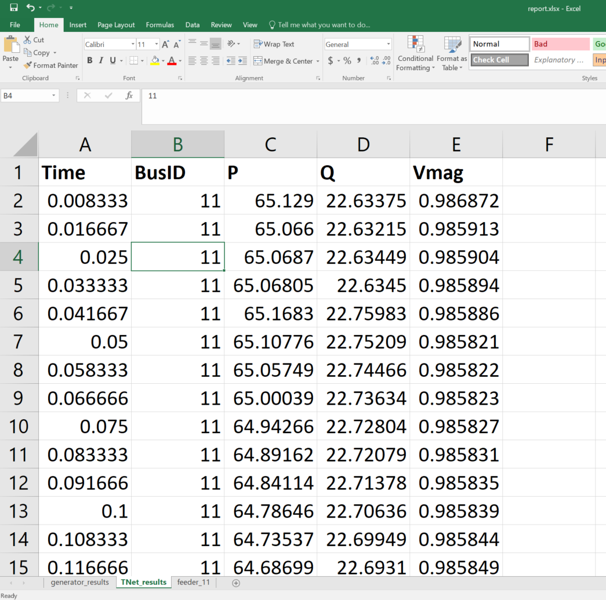

# Getting started with TDcoSim

In this section, we describe how you can get started with using **TDcoSim** to conduct static or dynamic co-simulation studies for T & D systems with different DER penetration levels and various events.

## 1. Setup TDcoSim

Please install the software per installation instructions as the first step (Installation instructions for can be found [here](user_guide_sys_requirements.md)). Make sure the system requirements are satisfied (System requirements can be found [here](user_guide_installation.md).) 

## 2. Configure T & D & DER models and simulation scenarios

### Specify parameters
1. Specify parameters for the power system to be analyzed:
   
   * Transmission system
        * Transmission system model (e.g. IEEE 118 bus system)
        * Buses where distribution system models are attached
   * Distribution system
        * Distribution system model (e.g. IEEE 123 node feeder)
        * Solar PV penetration level as a fraction of the distribution system load
   * DER characteristics (optional)
        * DER voltage and power ratings (e.g. 50 kW, 175 V)
        * DER low voltage ride through settings (e.g. 0.7 p.u., 10 s)
   
2. Specify whether simulation is static or dynamic.

3. Specify length of simulation (e.g. 5 s).

4. Specify transmission bus fault events (optional).

   * Start and end time of fault (for e.g. 0.5 s, 0.667 s)
   * Bus at which fault occurs and fault impedance value.

***
***Note:*** Frequency ride through will be included in future version.

***
***
***Note:*** Other disturbance events like loss of generator, line trip etc. will be included in future version.

***

### Transfer the configuration to TDcoSim

The power system models and simulation scenarios defined in the previous section can be transferred to TDcoSim using the **config** file (detailed explanations for every entry in the **config** file is provided [here](user_guide_cosimulation_details.ipynb)). The file formats currently supported are:

* Transmission system model: *.raw, *.dyr
* Distribution system model: *.dss

***
***Note:*** The **config** file can be edited with Notepad++.

***
***
***Note:*** The **config** file should be in the same folder as **tdcosimapp.py**.

***

## 3.  Start a co-simulation

Once the **config** file has been filled with the required entries and saved, the user can start the co-simulation by running **tdcosimapp.py** Python script. To do this open the [command line prompt ](user_guide_visual_guide.md) within the folder containing the **tdcosimapp.py** and run the following script.

```
python runtdcosimapp.py > log_file.txt
```

***
***Note:*** tdcosimapp.py is the default name of script that starts the co-simulation. If desired the user can write his/her own script by following the instructions given [here](user_guide_using_tdcosim.md).

***
***
***Note:*** Logs generated during co-simulation are written to log_file.txt (or any other user specified **.txt file**).

***

## 5.  Accessing the results

Outputs (from both transmission and distribution systems) are saved as an MS Excel file (**.xlsx**) at the end of the co-simulation as shown in Fig. 1. Additionally a PSS/E channel output file (**.out**) is created containing all the simulated quantities from PSS/E.


<p align="center">
  <strong>Fig. 1. </strong>Dynamic T&D co-simuation report in MS Excel format.
</p>

***
***Note:*** Both the **.xlsx** file and the **.out** file will be found in the same folder as tdcosimapp.py.

***

## Prebuilt templates

**config** files for static and dynamic co-simulation scenarios are provided in the '**examples**' folder within the TDcoSim repository. These may be run by executing run_qsts.py and run_time_domain.py respectively as shown in step 4 (after replacing tdcosimapp.py with the appropriate file name).