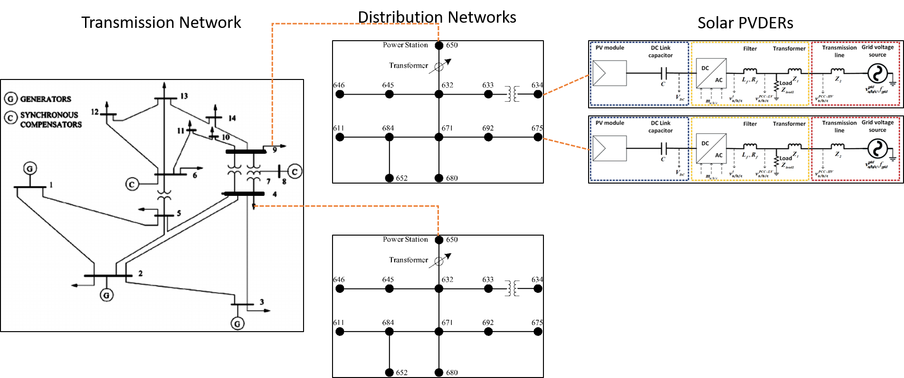

# Introduction

T&D co-simulation can be a powerful tool to capture short and long term dynamics between the transmission system and distribution system with a higher degree of fidelity and convenience than would be possible with running separate simulations for each system.

This guide is intended to introduce the user to the usage and working of the Argonne T&D co-simulation tool (**TDcoSim**). Multiple examples, have also been included to illustrate the capabilities of the tool.

## What is it?

**TDcoSim** is a software tool that  can be used to perform static and dynamic co-simulation of transmission and distribution networks with photovoltaic systems as distributed energy resources (PV-DER's). The following figure illustrates the various components that can be simulated using **TDcoSim**. 

  <strong>Fig. 1.</strong>Components that can be simulated using TDcoSim.

## How can I use it?
**TDcoSim** is available as an open source Python package and can be installed for free from it's GitHub repository. Additionally, the user needs to separately install [PSS®E](https://new.siemens.com/global/en/products/energy/services/transmission-distribution-smart-grid/consulting-and-planning/pss-software/pss-e.html) for simulating the transmission network, [OpenDSS](https://sourceforge.net/projects/electricdss/) for simulating the distribution network, and [Solar PV-DER simulation-utility.](https://github.com/sibyjackgrove/SolarPV-DER-simulation-utility) for simulating PV-DER's. Detailed installation instructions and links can be found [**here**](user_guide_installation.md).

## What are it's inputs?

In order to run a co-simulation using **TDcoSim**, the user needs to provide the following inputs:

* Transmission and distribution system model in a format that is understood by PSS/E and OpenDSS respectively (required).
* DER penetration level and ratings (optional).
* Fault events (optional).

## What are it's outputs?

**TDcoSim** provides following outputs from each component of the T&D co-simulation:

* Transmission bus: voltage, frequency, active and reactive load, generator active and reactive power output
* Distribution feeder node: voltage, active and reactive load, DER active and reactive power output

## Intended use cases

**TDcoSim** is not intended to be used a generic co-simulation platform like HELIC's. It is specifically meant to be used as a tool for studying static and dynamic impact of distributed energy resources on the transmission system. The use cases possible with the current version of the software are listed below:

* Static studies
  1. Analyze generator dispatch with DER over 24 hours.
  2. Analyze voltage profile of both T-system and D-system with DER.

* Dynamic studies
  1. Impact of DER's tripping during transmission system faults.
  2. Impact of DER's riding through during transmission system faults.

The use cases planned in the next version of the software are listed below:

* Dynamic studies
  1. Impact of cloud cover event on conventional generators.
  2. Impact of unbalanced faults on DER tripping and ride through.
  3. Impact of line outages. 
  4. Impact of generator and load outages on system frequency under high DER penetration.
  
## Scalability and Solution time

The size and complexity of the T+D+DER system to be co-simulated is only limited by the available  memory (RAM) in the workstation. The solution time for a T+D+DER co-simulation depends both on the OpenDSS instances and PV-DER instances as well as the number of of logical cores available in the workstation. 

[Continue to Getting Started?](user_guide_getting_started.md) 
