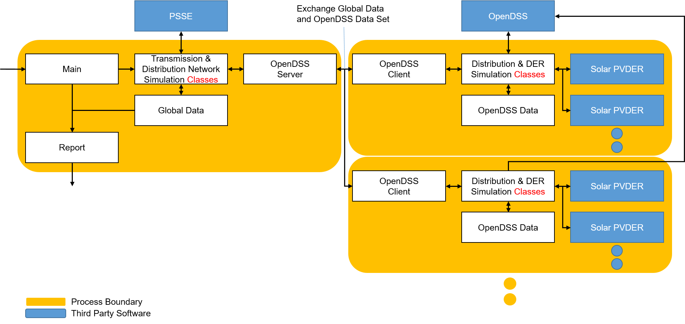

# Software details

## Features
1. Capable of launching sub-processes for individual feeders.
2. Capable of configuring each feeder with different DER penetration levels, ratings, and ride through settings.
3. Introduce fault events during simulation.
4. Captures and reports data from both transmission and distribution system for the entirety of the co-simulation.

## Main components
The T&D co-simulation tool comprise interface modules and a synchronization module. There are separate interface modules with sockets and interaction protocols for both the T & D and D & DER co-simulations.

**1. T&D interface:**
A Python program that exchanges and iterates information (voltages, currents, and powers) between T&D simulators through synchronization protocols (loosely or tightly coupled). The data being exchanged, and the utilized protocols and the T&D interface will be introduced in the later section of the document. The Python-based T&D interface is simple and light-weighted. Moreover, for version change of PSSE and/or OpenDSS, may be covered with the libraries  of the software. 

  * Loosely coupled methods: There is a one-step lag in information exchange between transmission and distribution, but less computation is required. 

**2. D&DER interface:**
A Python program that exchanges information between the distribution system and the dynamic DER model.

**3. Configuration file:**
It is the main user interface that allows user to configure a T+D or T+D+DER co-simulation. 

## External components
1.[PSS®E](https://new.siemens.com/global/en/products/energy/services/transmission-distribution-smart-grid/consulting-and-planning/pss-software/pss-e.html)
It is an off-the-shelf positive-sequence dynamic simulator, is a transmission simulator. 

2.[OpenDSS](https://www.epri.com/#/pages/sa/opendss)
It is a three-phase unbalanced distribution system dynamic simulator, is a distribution simulator.

3.[Solar PV-DER simulation utility](https://github.com/sibyjackgrove/SolarPV-DER-simulation-utility)
It is Python utility than can simulate dynamics of grid connected solar PV-DER systems. It uses dynamic phasor models and has single and three phase PV-DER's. 

## Software architecture
A schematic showing the software architecture of the TDcoSim package is shown in the Fig. 1.

  <strong>Fig. 1.</strong> Highlevel software architecture

The T&D co-simulation tool runs with multiple processes. The main process runs the transmission network simulation with PSSE and generates a report of the simulation. Each sub processes runs the distribution network simulation with OpenDSS and PV-DER. The tool uses the TCP sockets to exchange the data between main and sub processes. The detail simulation architecture is shown in the Fig.2.

  <strong>Fig. 2.</strong> Detailed simulation architecture

The simulation is managed by procedures for each model. The procedures define the simulation orders between multiple simulation objects. The models represent the single simulation object that includes the control of the power system. The procedures have hierarchical one-to-many relationships. The simulation type procedures are connected to multiple OpenDSS procedures via OpenDSS model, and the OpenDSS procedures are connected to multiple PVDER procedures via PVDER Aggregation model.

### Sequence of operations

The sequence of operations within the program is listed below:

1. Open TCP server sockets
2. Create a transmission network object
3. Create transmission network bus objects
4. Create distribution network objects
5. Create sub-processes
6. Establish TCP connection
7. Connect to OpenDSS via COM-Interface
8. Run the distribution network simulation
